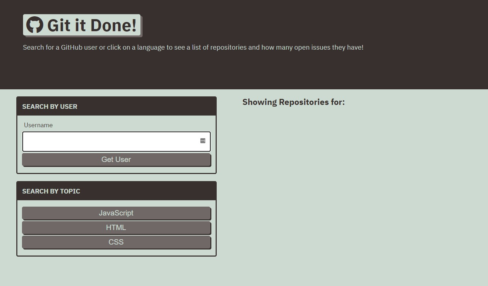

# Git-it-done

## Description

A web app that use's GitHub's API to search for open source projects with open issues and pull requests.

## Review

- Deployed application: [https://rogerscl116.github.io/git-it-done](https://rogerscl116.github.io/git-it-done)   
- GitHub repository: [https://github.com/rogerscl116/git-it-done](https://github.com/rogerscl116/git-it-done)
- 
## Screenshot

